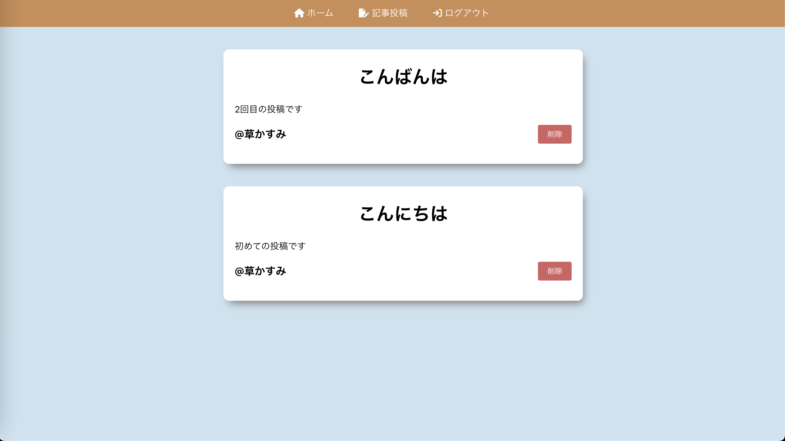

# ブログアプリ

## 概要

> - ReactとFirebaseでブログを構築してみました。
> - Udemyの動画を参考にハンズオンで作成しています。

## 機能

- タイトルと記事内容をセットで投稿できます。
- 投稿した記事を降順（新しい順）で一覧表示します。
- 投稿した記事を削除することができます。
- Googleアカウントを使用したログイン/ログアウト機能をサポートしています。
- 投稿データはFirebaseに保存されます。
- (今後)投稿記事にコメントを追加できる機能を実装予定
- (今後)投稿記事をキーワードで検索できる機能を追加予定